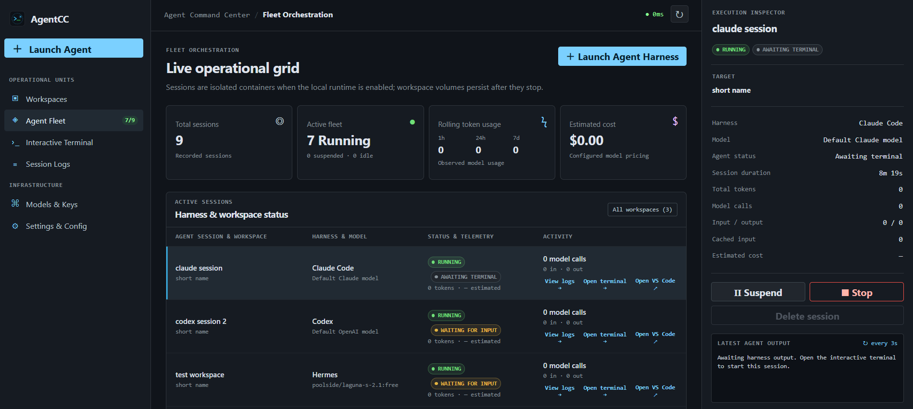

# Agent Command Center

AgentCC is a local-first command center for isolated coding-agent workspace
sessions. It gives teams a practical middle ground between running powerful
agents directly on a developer machine and building a full cloud platform:
each agent gets its own container, while users retain a familiar browser-based
VS Code workspace, persistent terminal, durable files, and operational view.



## Why use AgentCC?

- **Contain agent work.** Each session runs in its own constrained container,
  preventing one agent's tools, processes, dependencies, or filesystem state
  from interfering with another session.
- **Keep useful work after the agent stops.** Shared workspaces are durable and
  can be mounted into future sessions. They can be moved to trash and restored
  without losing files; permanent deletion is explicit and guarded.
- **Give people a rich control surface.** Users work in hosted VS Code instead
  of a limited custom file browser, reconnect to the same persistent harness
  terminal, and inspect live output or durable conversations without hunting
  through container logs.
- **Operate multiple harnesses consistently.** Codex, Hermes, Claude Code,
  and Kilo Code use reviewed adapters for launch configuration, logs,
  transcripts, and telemetry instead of each harness exposing a different UI.
- **Keep control local.** The initial deployment targets a trusted local
  network. Session ports remain private; AgentCC relays terminal and VS Code
  traffic to the browser through its own same-origin gateway.

## Current capabilities

- Isolated Docker sessions with resource limits, dropped Linux capabilities,
  no published session ports, and one persistent `tmux` harness per session.
- Hosted VS Code (`code-server`) and an xterm.js terminal in the same session
  container. Browser disconnects do not end the harness process.
- Durable shared workspaces backed by Docker volumes or approved host paths.
  Workspace cards show file count and storage use when the Workspaces page is
  opened; users can refresh the snapshot manually.
- Soft deletion and recovery for workspaces. A hard delete removes the durable
  content only after running sessions have stopped and retained session records
  have been removed.
- Model registry and encrypted credential vault for reviewed OpenRouter and
  Local gateway adapters, with optional reasoning effort and token pricing.
- Per-session telemetry for model calls, token categories, optional estimated
  cost, duration, activity state, live terminal output, raw logs, and formatted
  agent conversations.
- Startup recovery for recorded running containers, plus safe repair of stale
  Docker Desktop host-bind volume references when a new session is launched.

## Architecture

| Component | Responsibility |
| --- | --- |
| React + TypeScript frontend | Fleet, workspace, terminal, VS Code, logs, model, and settings UI. |
| FastAPI backend | REST API, WebSocket terminal relay, policy boundary, SQLite metadata, credential vault, and Docker orchestration. |
| Docker Engine | Creates the private session network, isolated harness containers, and durable workspace volumes. |
| Session image | `code-server`, the selected harness, `tmux`, Python tooling, and the controlled bootstrap entrypoint. |

Session containers never expose their own host ports. The API connects to the
private session network and relays authorized browser traffic to xterm and
code-server. Docker socket access is therefore deliberately an opt-in feature
for trusted hosts only.

## Run locally

Development needs Python 3.13+ and Node 22+. Run these commands from the
repository root:

```sh
python3 -m venv .venv
.venv/bin/pip install -r backend/requirements.txt
export AGENTCC_DATA_DIR="$PWD/.data"
.venv/bin/uvicorn app.main:app --app-dir backend --reload --port 9000
```

The backend automatically creates `AGENTCC_DATA_DIR` and stores its SQLite
database, credential vault key, and session logs there. It needs read/write
access to this directory and permission to create it in its parent directory
if it does not exist. The repository-local `.data/` directory is ignored by
Git. Without this setting, the backend uses the absolute path `/data`, which
is mounted as a persistent volume in Docker Compose and may not be writable
when running directly on your host. No manual directory creation is needed.

In a second terminal:

```sh
cd frontend
npm install
npm run dev
```

Open `http://localhost:5173`. The Vite server proxies API calls to port 9000.

## Containerized MVP

After building the frontend dependencies once, start the two services with:

```sh
docker compose -f deploy/compose.yaml up --build
```

Open `http://localhost:8080`.

The isolated code-server and harness images live in [`images/`](images/README.md).
The default stack persists its SQLite database in the `agentcc-data` Docker
volume but cannot create session containers. To use durable Docker-backed
workspaces and local session provisioning, build the image for each harness
you enable (`agentcc-session-codex:dev`, `agentcc-session-hermes:dev`,
`agentcc-session-claude-code:dev`, and/or `agentcc-session-kilocode:dev`)
and use the runtime override:

```sh
docker compose -f deploy/compose.yaml -f deploy/compose.runtime.yaml up --build
```

This mounts the Docker socket into the API container, which is effectively
host-root authority. Only use it on a trusted local development host. The
Workspace files are intentionally handled by hosted VS Code rather than a
duplicate command-center file API. Running sessions expose a same-origin
hosted VS Code route through the AgentCC gateway; no session container port is
published to the host or LAN. The interactive
terminal is available for running sessions: it renders the selected harness
CLI in the browser via xterm.js and retains bounded terminal output and errors
in the local session log buffer. Each agent session owns one detached harness
`tmux` session; navigating away or disconnecting a browser closes only its
tmux client and does not start or terminate the agent. Reopening the terminal
attaches to the same process and replays retained output.

## Run the public images

To run the published `0.1.0` images on a trusted local host or private LAN,
use the self-contained public deployment file:

```sh
docker compose -f deploy/compose.public.yaml pull
docker compose -f deploy/compose.public.yaml up -d
```

Open `http://localhost:8080`. The API is available on port `9000` for local
diagnostics; session containers themselves do not publish host ports. This
deployment mounts `/var/run/docker.sock` into the API so it can create and
manage isolated sessions. Treat that socket as host-root authority and do not
expose this stack directly to an untrusted network.

By default, durable workspaces are Docker volumes. To use approved host paths
instead, set an absolute, existing path before starting the stack:

```sh
export AGENTCC_WORKSPACE_HOST_ROOTS=/srv/agentcc/workspaces
docker compose -f deploy/compose.public.yaml up -d
```

You can override the image names or ports with `AGENTCC_*_IMAGE`,
`AGENTCC_WEB_PORT`, and `AGENTCC_API_PORT` environment variables. See
[`deploy/compose.public.yaml`](deploy/compose.public.yaml) for the complete
set of selectable harness image variables.

For host-visible durable workspaces, set `AGENTCC_WORKSPACE_HOST_ROOTS` in
`deploy/compose.runtime.yaml` to one or more comma-separated absolute paths
accessible to the Docker daemon. Settings & Config selects the default only
from those approved roots; each new workspace receives a readable
`workspace-name-uuid8` directory under the selected root. Existing workspaces
are never moved.

## Workspace lifecycle and retention

The **Workspaces** view is the durable asset catalog. A workspace may be used
by many sessions over time; a session also has its own disposable private
volume for harness state.

- **Move to trash** is a soft delete. It hides the workspace from new-session
  selection but preserves its files and completed-session history. Restore it
  from **Workspace trash** at any time.
- **Permanently delete** removes the verified Docker volume or approved
  host-path directory and then removes the workspace metadata. The UI blocks
  deletion while a session is running, and the API requires all associated
  session records to be deleted before permanent deletion.
- **Usage snapshot** counts regular files and reports logical storage usage.
  AgentCC reads this once on entering the Workspaces page and does not poll;
  use the `↻` control to request a new read-only snapshot.

For host-backed workspaces on Docker Desktop/WSL, an operating-system or
Docker Desktop restart can leave Docker with an expired internal bind-mount
reference even though the host files remain intact. When a new session is
launched, AgentCC recognizes that error and safely recreates the verified
volume reference when no container is using it.

The Codex session image includes `python`/`python3`, `venv`, and `pip`. Install
project libraries in a workspace-local virtual environment (`python -m venv
.venv` followed by `.venv/bin/python -m pip install -r requirements.txt`),
which is preserved with the workspace volume. Session users deliberately do
not receive `sudo`: repeatable OS-level tools belong in a derived, pinned
session image rather than an unrestricted root shell.

## Model registry and credential vault

Use **Models & Keys** to register one of the reviewed providers: **OpenRouter**
or **Local gateway**. The latter reaches a service running on the Docker host;
AgentCC translates a `localhost` endpoint to `host.docker.internal` only for
that session and adds Docker's host-gateway alias. The registry stores the
provider label, endpoint, model name, and reasoning effort;
the API key is encrypted before it reaches SQLite and is never returned by the
API (the UI displays only its last four characters). Select a registered model
while launching a Codex, Hermes, Claude Code, or Kilo Code session. For OpenRouter, AgentCC writes a per-session
`/home/agent/.codex/config.toml` using Codex's named-provider configuration
and exposes `OPENROUTER_API_KEY` only to the authorized harness process (never
to code-server or the browser). The configuration contains an auth command,
not the API key itself. Other providers and harnesses require their own
allowlisted adapters; AgentCC does not apply a generic environment-variable
fallback. Hermes uses the selected model to generate
`/home/agent/.hermes/config.yaml`, launches in a local workspace terminal, and
reads its canonical SQLite session store for transcript and token telemetry.
For a Local gateway, Codex requires an OpenAI Responses endpoint, Hermes and
Kilo Code require an OpenAI-compatible endpoint, and Claude Code requires an
Anthropic Messages-compatible endpoint (a local proxy can expose both). Claude
Code uses OpenRouter's Anthropic-compatible API endpoint with an
`ANTHROPIC_AUTH_TOKEN` scoped to the harness process; its JSONL transcript is
used for the same conversation and token telemetry views.

By default, the API creates a Fernet vault key at `/data/vault.key` with owner
read/write permissions. The standard Compose stack keeps it in the persistent
`agentcc-data` volume. For an installation where the data volume is not an
appropriate key store, set `AGENTCC_VAULT_KEY` to a stable Fernet key through
your local secret-management mechanism before starting the API. Do not rotate
or replace this key until existing credentials have been re-encrypted.

## Public images

AgentCC's public Docker Hub namespace is `nievric`. Image names and the
release verification process are documented in
[docs/PUBLISHING_IMAGES.md](docs/PUBLISHING_IMAGES.md).

## License

AgentCC is licensed under the [Apache License 2.0](LICENSE). Container images
also include third-party software with their own terms; see [NOTICE](NOTICE)
and retain the applicable notices identified for each released image.
