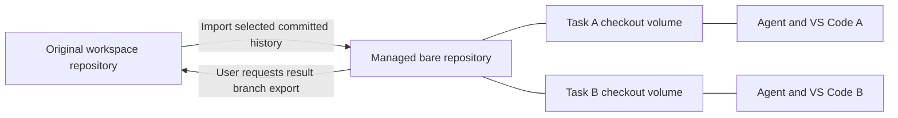

# Managed Git worktrees for parallel agents

**Status:** stages 1–3 implemented in the local development tree. Guided
application (stage 4) remains future work. See [test coverage](../backend/tests/README.md).

**Scope:** local Docker runtime, existing four harnesses, Docker-volume and
approved host-path workspace storage.

## 1. Outcome

A user selects a workspace, describes a task, and launches an agent on a separate
branch. AgentCC creates the checkout, connects the terminal and VS Code to it,
retains the work, and helps the user bring the result back. The normal flow
requires no `git worktree` commands.

The user-facing choice is **Separate branch (recommended)**. A short explanation
says: "Give this agent its own files and branch. Other tasks keep their changes."
Advanced details can show the term **Git worktree**, branch, and starting commit.

## 2. A brief introduction to Git worktree

A branch names a line of development. A checkout is the directory of files you
edit. Switching branches in one directory changes those files for everyone using
that directory.

Git worktrees let one repository have several checkout directories at once.
Each linked checkout has its own files, index, and HEAD; Git objects and branch
references are shared. One agent can work on a login fix while another edits
documentation in a different directory. Git normally prevents the same branch
from being checked out twice. See the official
[Git worktree documentation](https://git-scm.com/docs/git-worktree).

Worktrees isolate routine file edits. They do not provide a security boundary
between agents that share writable Git metadata, and they do not prevent merge
conflicts when two tasks change the same lines. Existing container constraints
remain useful.

## 3. Behavior before implementation and constraints

- `DockerContainerRuntime._run_session_container` mounts the selected workspace
  read/write at `/workspaces/shared/<folder_name>` for every attached session.
  Its default working directory is that shared checkout.
- A session also owns a disposable volume at `/workspaces/session`. A task
  checkout must survive deletion of that disposable runtime volume.
- `open_terminal` and the Hermes adapter also construct the shared checkout path.
  Changing Docker's working directory alone would leave inconsistent behavior.
- The bootstrap opens `/workspaces` in code-server and prepares mount ownership.
  Isolated sessions should instead open their selected checkout directly.
- Workspace metadata, soft deletion, hard deletion, and session references are
  already persisted in SQLite. New repository assets must participate in those
  lifecycle rules.

Relevant code: [`runtime.py`](../backend/app/runtime.py),
[`harnesses.py`](../backend/app/harnesses.py),
[`models.py`](../backend/app/models.py), [`store.py`](../backend/app/store.py),
[`main.py`](../backend/app/main.py),
[`entrypoint.sh`](../images/base/entrypoint.sh), and
[`App.tsx`](../frontend/src/App.tsx).

## 4. User workflow and automation

### Start a task

1. The user chooses **Launch agent** from a workspace and enters the normal
   session name, harness, model, and task.
2. AgentCC checks whether the workspace contains a supported repository.
   Eligible repositories default to **Separate branch** in the new UI.
3. The default starting point is the original checkout's current committed HEAD.
   Show its branch and abbreviated commit; never assume the branch is `main`.
   Advanced options allow a different existing local branch and a branch name.
4. Generate a name such as `agentcc/fix-login-a1b2c3d4`, reserve the task, create
   the checkout, and launch the session against it.
5. Group the task under its parent workspace. Its **Open terminal** and
   **Open VS Code** actions address that task's checkout.

Example workspace card:

```text
Website
  Original workspace                  main
  Fix login                           agentcc/fix-login-a1b2c3d4
  Update help pages                   agentcc/update-help-e5f6a7b8
  [+ Launch agent]
```

Other choices are **Continue an existing task** and **Use original workspace**.
Continuing reuses the existing checkout and branch, including uncommitted work;
it does not create another checkout or imply native conversation restoration.

| Situation | Product behavior |
| --- | --- |
| Normal committed repository | Create the branch and checkout automatically after Launch. |
| Original checkout has local edits | State that the task starts from the last commit and excludes those edits. Offer "Use committed version" or return to VS Code to commit selected files. Do not silently stash, commit, or copy them. |
| No repository or no initial commit | Explain why separate branches are unavailable; offer the original workspace and an Open VS Code action for setup. Do not silently initialize Git. |
| Requested branch already exists or is occupied | Offer the existing task or a different name; never reset it to make the request succeed. |
| Task already has an active session | Open that session. Require stopping it before another session can write the same task checkout. |
| Agent stops or its session is deleted | Retain the task checkout and branch for review or continuation. |
| Dependencies, ignored files, or `.env` are absent | Explain that only committed project files form the new checkout. Setup runs inside the task container through existing tools; do not copy secrets or execute repository setup scripts automatically. |

The first release can cover launch, continuation, retention, review in VS Code,
and exporting a result branch. Guided application to the original checkout is a
separate increment described below. General unattended harness startup remains
a separate feature; this proposal does not require changing the current
first-terminal-attachment startup behavior.

## 5. Repository and storage design

### Recommended: managed repository plus durable task volumes

Keep the original workspace unchanged. For each participating workspace, create
one AgentCC-managed **bare repository** in a dedicated metadata volume. A bare
repository stores Git history and references without an ordinary checkout.
Create the task worktrees from that repository, each in its own durable volume.

This is an explicit design choice: tasks are linked worktrees of the managed
repository, not directly of the user's original `.git` directory. Import local
committed history at task creation and export reviewed result branches when
requested. Do not move the original `.git` directory or continuously mirror refs.



Each container that accesses an asset uses the same absolute internal path:

| Asset | Container path | Mounted into |
| --- | --- | --- |
| Managed repository volume | `/var/lib/agentcc/repos/<workspace-id>`; repository is its `repo.git` child | Task sessions and operation helpers for that workspace |
| Task checkout volume | `/workspaces/tasks/<worktree-id>`; checkout is its `checkout` child | Only its owning task session and operation helpers |
| Original workspace volume | Existing path for original sessions; `/source` in an import/export helper | Original sessions and narrowly scoped helpers |
| Disposable session volume | `/workspaces/session` | Its session only |

An isolated task container receives its own checkout and the managed repository,
but neither the original checkout nor sibling task volumes. Keep the repository
mount outside the code-server project folder. Both agent and coder need suitable
group permissions and exact trusted-repository configuration where Git ownership
checks require it; do not use a global `safe.directory=*` workaround.

Linked Git directories depend on their common repository and store links back
to the checkout; this is why the internal paths must remain stable. See
[Git repository layout](https://git-scm.com/docs/gitrepository-layout).

The checkout is a **child of the volume mountpoint**, so removing it does not ask
Git to remove the mountpoint itself. Lock managed worktree registrations with an
AgentCC reason because sibling volumes are intentionally absent from most
containers. These Git locks prevent pruning of temporarily unavailable checkouts;
they are separate from the application locks used to serialize operations.

Docker-volume and host-backed task storage use the same internal layout. For a
host-backed parent, default task directories to UUID-labelled siblings under the
same approved host root, keeping tasks out of the original checkout. Host files
remain inspectable, but native host Git inside those task folders is not a v1
promise: their `.git` links point into the container namespace. Hosted VS Code
and the AgentCC terminal provide supported Git access. Native host Git in the
original workspace continues to work unchanged.

### Import and export behavior

Initialize an empty managed bare repository and import the selected source commit
through local Git transport. Retain it under `refs/agentcc/bases/<worktree-id>`;
create the task branch from that exact object ID. Avoid object alternates and
hardlinks so tasks remain valid if source storage changes. Do not copy source
credentials, hooks, or arbitrary Git configuration. There is no automatic remote
fetch, pull, or push.

Commit authorship is a separate workspace setting. Offer to reuse only the source
repository's author name/email, or let the user configure them once if absent;
do not invent an identity. Handle signing requirements explicitly before a
managed commit workflow is offered. This does not authorize automatic commits.

Subsequent tasks import their own selected source commit. Existing task branches
never move merely because the source branch advances. Tasks share the managed
object store, so the repository copy is per workspace, not per agent.

**Make branch available in original workspace** imports the task's reviewed tip
into a named local branch there. The original checked-out branch and files stay
unchanged. If the destination ref exists, compare its expected value and refuse
an unexpected or non-fast-forward update. Persist the exported commit ID so later
task commits are not mistaken for already-exported work. Export is an explicit
local ref mutation, not a remote push or a merge.

### Alternatives considered

| Approach | Decision |
| --- | --- |
| Worktrees inside the existing shared workspace mount | Simpler, but every task still receives the original and sibling checkout files. Avoid for the default isolated workflow. |
| Mount only the original `.git` subdirectory into each task | A viable alternative that avoids the repository copy and export step. It shares original refs, configuration, and administration with task processes and needs Docker Engine/SDK compatibility checks. The proposed managed store instead keeps task refs separate until export. |
| Move or split the original `.git` directory into a new volume | Avoids a metadata copy, but requires migrating existing storage and preserving host/container Git paths. Too invasive for the first release. |
| Separate clone for every task | Stronger repository separation, but duplicates repository storage and loses the shared worktree lifecycle. Possible future isolation mode. |
| Managed repository with task worktrees | Recommended. Adds one repository copy and explicit result export, while preserving existing workspaces and separate checkout mounts. |

Docker documents [`volume-subpath`](https://docs.docker.com/engine/storage/volumes/#mount-a-volume-subdirectory)
for mounting an existing volume subdirectory. The direct-metadata alternative
should be evaluated during the storage proof before committing to the extra
managed-repository layer; it must never fall back to mounting the full source
checkout into isolated sessions. Whichever approach is selected should be one
explicit storage format, not an automatic per-launch switch between semantics.

## 6. Data model and API

Use a `Worktree` resource subordinate to the existing `Workspace`; do not turn
tasks into unrelated workspace rows. A task can outlive and be reused by several
sessions over time. Original workspace sessions retain their existing meaning.

| Record | Proposed additions |
| --- | --- |
| Workspace repository | Parent workspace ID, metadata volume name, storage format version, readiness/error state. Initially support one root repository per workspace. |
| Worktree | ID, parent workspace ID, display name, branch ref, source branch, immutable base commit, checkout volume/host path, creation time, lifecycle state, last observed tip, exported tip, archive/removal times, last error. |
| Session | Nullable `worktree_id`; persist the checkout assignment. Derive internal paths from validated IDs and the storage version. |
| Operation | ID, idempotency key, kind, workspace/worktree IDs, phase, resource labels, expected refs, progress/error, timestamps. |
| Checkout reservation | Unique checkout identity and owning session/operation. Covers starting, running, paused, and uncertain runtime states. |

Suggested worktree states: `creating`, `ready`, `archived`, `removing`, `removed`,
and `needs_attention`. Git dirty state and session activity are separate facts.
Retain removed-task metadata while its branch/history remains managed.

Implemented API surface, under `/api/v1`:

| Endpoint | Purpose |
| --- | --- |
| `GET /workspaces/{id}/repository` | Capability, source branch/HEAD, local edits, selectable local branches, and unavailable reason. |
| `GET /workspaces/{id}/worktrees` | Task list, branch, status, attached session, and last observed Git facts. |
| `POST /workspaces/{id}/worktrees` | Prepare a task without launching an agent; return an operation ID. |
| `GET /operations/{id}` and `POST /operations/{id}/retry` | Creation/launch progress and recovery. Export and removal return their result directly; removal persists an intermediate state for safe retries. |
| `POST /sessions` with `checkout` | Select original files, create a worktree, or reuse an existing worktree. |
| `POST /worktrees/{id}/archive` and `/restore` | Mark or restore a retained task without deleting files. Archived tasks remain labeled in the workspace card. |
| `POST /worktrees/{id}/export` | Make a reviewed commit available as a local source branch. |
| `POST /worktrees/{id}/remove` | Remove an eligible checkout, retaining its branch/history. |
| `GET /worktrees/{id}` | Refresh observed Git state, including a retained branch whose checkout was removed. |
| `POST /worktrees/{id}/cancel-launch` | Clean up an uncertain launch and release its reservation while retaining task files. |

Example addition to a session launch request:

```json
{
  "workspace_id": "<workspace-uuid>",
  "name": "Fix login",
  "harness": "Codex",
  "task": "Fix the expired-token login flow",
  "checkout": {
    "mode": "new_worktree",
    "source_branch": "main",
    "expected_base_commit": "<commit-shown-in-launch-preview>"
  }
}
```

Other modes are `shared` and `existing_worktree` with a `worktree_id`. The server
generates names unless an advanced override is supplied. It verifies that the
worktree belongs to the requested workspace. Clients never supply volume names,
absolute paths, Git commands, or arbitrary revision expressions.

Missing `checkout` retains legacy shared behavior for old API clients. The new
UI sends its choice explicitly. A failed isolated launch never silently falls
back to shared files. Keep the existing synchronous response for ordinary launches;
new-worktree launches return `202` with an operation handle, requiring the new UI
to poll until a session or actionable error is available. Retry keys bind to the
request payload and cannot create a second branch/session after a timeout.

## 7. Runtime integration and failure recovery

Extract repository/worktree orchestration into a small service, with Git helpers
behind the existing Docker boundary. Keep models, persistence, API handling, and
runtime mount construction separate.

Creation sequence:

1. Validate repository capability, branch syntax, and the previewed source commit.
   If the branch moved, return a changed-base result for a refreshed preview.
2. Persist an operation and task ID; reserve the branch/checkout under a durable
   per-workspace mutation lock before creating external resources.
3. Verify/create labelled metadata and checkout storage. Run bounded helpers with
   only the required mounts, no network, and no provider credentials.
4. Import committed history and run `git worktree add` using argument arrays,
   an explicit new branch, the captured commit, and a managed worktree lock.
5. Verify Git registration, branch, paths, and HEAD, then mark the task ready.
6. Reserve its single writer and provision the normal session container using
   an explicit checkout target. Attach the terminal through the existing flow.

Use one checkout-target resolver for Docker cwd, Docker exec cwd, tmux creation
(`new-session -c`), all harness launchers, and code-server's project root. Remove
Hermes's assumption that every workspace lives under `/workspaces/shared`.
Bootstrap ownership must prepare the new verified mount roots without widening
host-path permissions. Other lifecycle/log/model behavior stays attached to the
session, not duplicated into the worktree service.

Git commands run as the workspace user using bounded subprocesses and explicit
argv. Disable hooks for controller-owned maintenance commands using a per-command
setting; do not alter normal agent Git behavior. Git documents
[`core.hooksPath`](https://git-scm.com/docs/git-config#Documentation/git-config.txt-corehooksPath)
as the mechanism for selecting or disabling hook execution. Reject unsupported
checkout filters/configuration rather than executing unexpected setup programs in
a privileged helper.

Never hold a SQLite write transaction while waiting for Git or Docker. The local
runtime can use process-shared file locks under its data directory for workspace
mutations, backed by durable operation rows and checkout reservations. Git's own
ref/index locks still apply. A process crash releases the file lock; persisted
phases make the unfinished operation discoverable.

On restart, reconcile unfinished operations against verified Docker labels and
Git registrations. A lost HTTP response must not create duplicate work. A
container launch failure leaves a successfully prepared task available for retry.
An ambiguous partial checkout is retained as `needs_attention`, not automatically
deleted. Do not release a writer reservation merely because Docker is unreachable;
verify its session has stopped before reassigning the checkout.

## 8. Review, application, and cleanup

### First release: retain and export

Stopping an agent never merges, commits, archives, or deletes its task. Show
**Continue task**, **Review in VS Code**, **Make branch available in original
workspace**, and **Archive**. Review uses existing VS Code Git capabilities.
Export includes committed changes only; identify uncommitted work clearly.

### Follow-up: guided application

Add **Apply reviewed changes** with a concrete source branch, task tip, target
tip, and diff preview. Recheck those values before applying. Require a clean
target checkout, no in-progress Git operation, and no active AgentCC writer in
either affected checkout. Never silently commit files or switch the source branch.

For a fast-forward result, advance the original checkout after the user invokes
Apply. If the histories diverged, prepare a separate integration task from the
latest target commit and merge there. Resolve conflicts in its VS Code workspace,
then review and fast-forward the original to the integration result after checking
the target has not advanced. No automatic conflict resolution or force reset.
Changes made outside AgentCC can still race; revalidate Git state and surface
failures rather than reporting a successful application from stale metadata.

This keeps Git decisions understandable: "Review changes", "Apply changes", and
"Resolve conflicts". The user does not need to manage worktree registrations.

### Retention rules

- One managed task checkout has at most one non-completed writer session. Paused
  sessions retain their reservation. This is not a lock against external tools.
- Archiving retains checkout files, Git registration, and branch. Stop attached
  sessions first; restoration reuses the same task.
- Session deletion removes only disposable session resources.
- Checkout removal requires no retained session references, verified ownership,
  and a fresh inventory of tracked, untracked, and ignored files. Ignored files
  may include credentials or useful local data; a clean tracked diff is not enough.
- V1 refuses removal when local files would be lost. Cleanup can be performed in
  VS Code; a future explicit discard flow must present the affected data first.
- Unlock the selected managed registration only for a verified removal operation,
  use normal `git worktree remove`, and relock it if removal fails. Remove the
  empty labelled checkout storage afterward. Keep the branch and base ref.
- Parent trash checks all descendant sessions; tasks cannot launch while the
  parent is trashed. Parent hard deletion is blocked by retained sessions,
  checkouts, or task history not exported or explicitly selected for deletion.
  The deletion preview includes the managed repository and retained branches.
- Unavailable mounts never imply abandoned work. Do not run broad automatic
  pruning or delete branches as a side effect of stopping sessions.

## 9. Compatibility and initial limits

Existing workspaces and running containers are not migrated or remounted.
Nullable session fields preserve their current paths. New isolated launches use
the new storage format; recreating their runtime must reuse that format and the
same IDs. Reuse the existing approved-root checks and stale-bind repair rules for
new asset kinds, with ownership labels and deletion checks extended accordingly.

The first slice supports a normal repository at the workspace root, with a
self-contained object database and at least one commit. Detect and explain
unsupported layouts before creating assets: nested/multiple repositories,
externally linked `.git` directories, submodules, partial clones, object
alternates, and checkout filters requiring unavailable tooling. Test shallow
repositories before enabling them. Native Git's worktree documentation notes
limitations around submodules, so they should not be silently advertised as
supported. Existing shared mode remains available.

No provider keys or host Git credentials are copied into the managed repository.
Remote authentication, remote runners, cloud storage, dependency caching, native
agent conversation restoration, and a general workflow engine are separate work.

## 10. Delivery and acceptance checks

| Stage | Deliverable |
| --- | --- |
| 1. Storage proof | Verify canonical mounts, permissions for both users, native Git commands, lock/prune behavior, and removal for named volumes and approved host paths. |
| 2. Backend lifecycle | Schema migration, repository probing, import/create/reuse/export/remove operations, durable reservations, and recovery. |
| 3. Runtime and UI | Checkout-target resolver, all four adapters, code-server root, launch options, grouped task cards, continuation, and clear unsupported/dirty states. |
| 4. Guided application | Previewed application, target validation, and integration tasks for diverged histories. |

Stages 1–3 are the first usable release. The earlier 2–4 engineer-week estimate
is provisional; confirm it after the Docker storage proof, particularly for
Docker Desktop/WSL and branch export. Guided application adds scope beyond basic
worktree creation and should be estimated separately.

Meaningful acceptance checks:

1. Launch two tasks from one source commit, change the same file differently, and
   verify each task and the original retain their own contents and branches.
2. Verify an isolated session does not mount original or sibling checkout volumes;
   ordinary `git status`, commit, diff, and VS Code Git work in its own checkout.
3. Verify every harness and its terminal start in the selected checkout, including
   Hermes and a replacement tmux session after container restart.
4. Reject duplicate writers even for concurrent requests or suspended sessions;
   preserve legacy shared launches and existing database contents after migration.
5. Interrupt creation after each external step; retry/restart without duplicate
   assets or deleting user work. Simulate Docker unavailability during recovery.
6. Retain task files after session deletion; verify archive/restore, dirty and
   ignored-file removal refusal, missing-volume behavior, and parent deletion guards.
7. Export the selected task commit without changing source checkout files; refuse
   unexpected destination refs and detect commits added after a prior export.
8. For guided application, cover dirty targets, stale previews, divergent histories,
   conflicts, and source advancement during review.
9. Exercise named volumes and approved host binds; Docker Desktop/WSL path and
   ownership checks are required before claiming that environment is supported.

### Design experiment completed

A disposable local Git 2.53.0 experiment verified an empty bare repository seeded
from a source commit, two independent linked checkouts, unchanged original files,
shared metadata, retention of a locked temporarily absent checkout during pruning,
result-branch export without changing source HEAD/files, dirty removal refusal,
and removal that preserves both the volume-parent directory and branch ref.

That initial experiment validated only Git mechanics. The implementation now
also has automated unit, SQLite migration, API, real-Git, browser, and Docker
integration coverage. Docker tests exercise actual mount namespaces, both Unix
users, the production bootstrap, tmux cwd, container restart, continuation after
session deletion, export, and cleanup with named volumes and approved host binds.
Browser tests cover the task lifecycle and explicit history-deletion confirmation
through the real API and Git using a fake container runtime.

Test boundaries: Docker fixtures substitute a local HTTP server for code-server
and a fixed process for the paid harness. All four harness mount configurations
and Hermes's tool cwd have unit coverage. Actual provider authentication and
the VS Code Git interface have not been exercised. Host-bind tests use the
Docker daemon's `/tmp`; Windows drive/NTFS permissions and an actual Docker
Desktop restart remain environment-specific manual checks. Stale-volume repair
guards are unit tested. See [test commands](../backend/tests/README.md).
